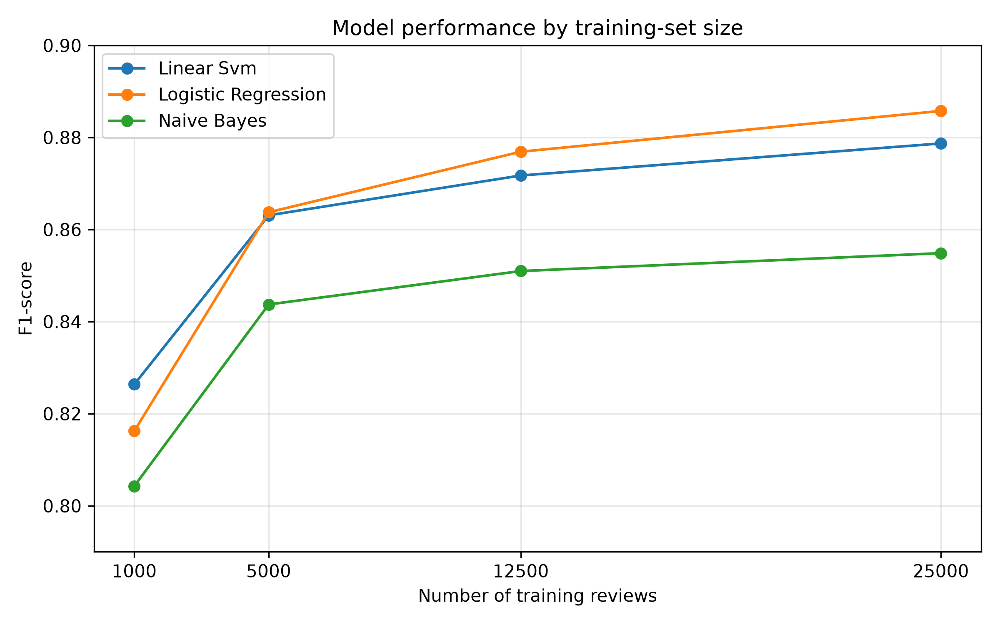
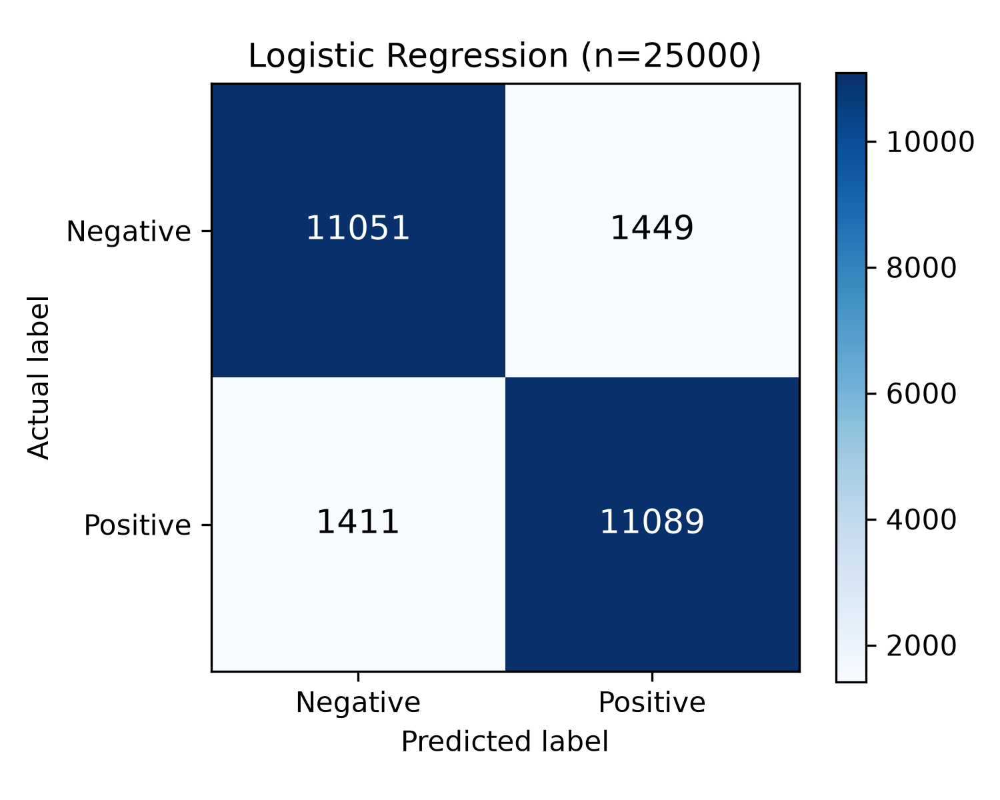
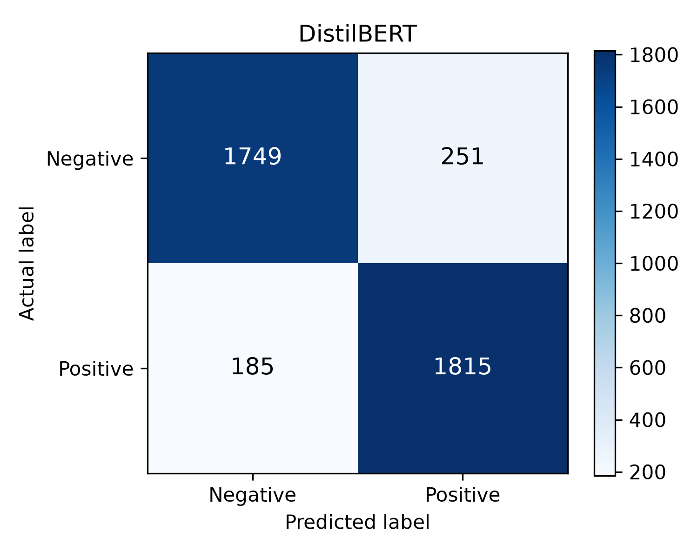

<div align="center">

# 🎬 Movie Review Sentiment Analysis

### Binary sentiment classification on 50,000 IMDb reviews — classical ML vs. a fine-tuned transformer

[](https://www.python.org/)
[](https://scikit-learn.org/)
[](https://pytorch.org/)
[](https://huggingface.co/)
[](https://www.nltk.org/)


</div>

---

## 📖 Overview

Can a machine read a movie review and tell whether the writer loved the film or hated it?

This project builds that system twice — once the **classical** way with TF-IDF features and
linear models, and once with a **fine-tuned transformer** — then compares them head to head.

| | Approach | Method |
|:---:|---|---|
| 📊 | **Classical** | TF-IDF → Naive Bayes · Linear SVM · Logistic Regression |
| 🤖 | **Transformer** | Fine-tuned DistilBERT (`distilbert-base-uncased`) |

The task also asks the system to be tested as the dataset grows, so every classical model is
trained **four times** — on 1,000 → 5,000 → 12,500 → 25,000 reviews — and always evaluated on
the same held-out test set. 📈

> 🎓 **Course:** DLBAIPNLP01 — Project: NLP (Task 1) · B.Sc. Applied Artificial Intelligence
> 🏫 **IU International University of Applied Sciences** · builds on DLBAIINLP01 (Introduction to NLP)

---

## 🏆 Key Results

<div align="center">

| 🥇 Model | Train size | Accuracy | Precision | Recall | **F1** |
|---|:---:|:---:|:---:|:---:|:---:|
| 🤖 **DistilBERT** | 4,000 | **0.8910** | 0.8785 | **0.9075** | **0.8928** |
| 📈 **Logistic Regression** | 25,000 | 0.8856 | 0.8844 | 0.8871 | 0.8858 |
| ⚙️ Linear SVM | 25,000 | 0.8799 | 0.8873 | 0.8702 | 0.8787 |
| 🎲 Naive Bayes | 25,000 | 0.8582 | 0.8754 | 0.8353 | 0.8549 |

</div>

**Three things the numbers say:**

- 🚀 **More data helps — until it doesn't.** The jump from 1,000 → 5,000 reviews is big; from
  12,500 → 25,000 it's marginal. TF-IDF hits a ceiling.
- 🥊 **Logistic Regression wins among the classical models**, thanks to the most balanced
  precision and recall.
- 🧠 **DistilBERT edges ahead on a fraction of the data** — it reads words *in context*, while
  TF-IDF sees only an unordered bag of terms.

> [!IMPORTANT]
> **The DistilBERT number is not a like-for-like comparison.** It was trained and evaluated on a
> 4,000-review balanced subset, because fine-tuning on the full dataset is too slow on a laptop.
> The classical models use the complete 25,000-review test set. DistilBERT is included as an
> *additional experiment*, not a strict benchmark. 🔍

---

## 📚 Dataset

The **[Stanford Large Movie Review Dataset](https://ai.stanford.edu/~amaas/data/sentiment/)** (Maas et al., 2011)

| Property | Value |
|---|---|
| 🎞️ Total reviews | 50,000 |
| 🏋️ Training | 25,000 (12.5k pos · 12.5k neg) |
| 🧪 Testing | 25,000 (12.5k pos · 12.5k neg) |
| ⚖️ Balance | Perfectly 50/50 — no class imbalance to correct |
| 🗑️ Quirks | Full-length, informal, and still full of leftover `<br />` HTML tags |

The unlabelled `train/unsup` folder is ignored — this is a supervised task.

---

## ⚙️ The Pipeline

```
📥 Load  →  🧹 Clean  →  🛑 Stop words  →  🌱 Lemmatise  →  🔢 TF-IDF  →  🎯 Train  →  📊 Evaluate
```

<details>
<summary><b>🔍 Click for the details of each step</b></summary>

<br>

1. **📥 Load** — read reviews from the `pos` / `neg` folders into a table
2. **🧹 Clean** — strip HTML tags, lowercase, drop non-letter characters
3. **🛑 Stop words** — remove them using the NLTK English list
4. **🌱 Lemmatise** — WordNet lemmatiser, chosen over stemming because it produces *real words*
   (`studies → study`, not `studi`)
5. **🔢 Vectorise** — TF-IDF with unigrams **and** bigrams (so `"not good"` survives as one
   feature), `min_df=2`, capped at 50,000 features
6. **🎯 Train** — the three classical models, at each of the four dataset sizes
7. **📊 Evaluate** — accuracy, precision, recall, F1 + confusion matrix
8. **🤖 Fine-tune** — DistilBERT on the same task, for comparison
9. **🔮 Predict** — classify a brand-new, unseen review

**🔒 No data leakage:** the TF-IDF vectoriser is fitted *only* on the training subset in each
experiment. **🎲 Fully reproducible:** a fixed random seed (42) is used everywhere.

</details>

---

## 📈 Results in Detail

### Classical models across dataset sizes

<div align="center">

| Model | 1,000 | 5,000 | 12,500 | 25,000 |
|---|:---:|:---:|:---:|:---:|
| 🎲 Naive Bayes | 0.8043 | 0.8437 | 0.8510 | 0.8549 |
| ⚙️ Linear SVM | 0.8264 | 0.8631 | 0.8717 | 0.8787 |
| 📈 Logistic Regression | 0.8163 | 0.8638 | 0.8769 | **0.8858** |

<sub>F1-score, evaluated on the full 25,000-review test set</sub>



</div>

<details>
<summary><b>📋 Click for the full metrics table (all models × all sizes)</b></summary>

<br>

| Model | Train size | Accuracy | Precision | Recall | F1 |
|---|:---:|:---:|:---:|:---:|:---:|
| Naive Bayes | 1,000 | 0.8130 | 0.8436 | 0.7685 | 0.8043 |
| Linear SVM | 1,000 | 0.8237 | 0.8141 | 0.8390 | 0.8264 |
| Logistic Regression | 1,000 | 0.8122 | 0.7992 | 0.8341 | 0.8163 |
| Naive Bayes | 5,000 | 0.8492 | 0.8752 | 0.8145 | 0.8437 |
| Linear SVM | 5,000 | 0.8633 | 0.8642 | 0.8620 | 0.8631 |
| Logistic Regression | 5,000 | 0.8627 | 0.8570 | 0.8706 | 0.8638 |
| Naive Bayes | 12,500 | 0.8551 | 0.8757 | 0.8277 | 0.8510 |
| Linear SVM | 12,500 | 0.8730 | 0.8801 | 0.8635 | 0.8717 |
| Logistic Regression | 12,500 | 0.8768 | 0.8758 | 0.8780 | 0.8769 |
| Naive Bayes | 25,000 | 0.8582 | 0.8754 | 0.8353 | 0.8549 |
| Linear SVM | 25,000 | 0.8799 | 0.8873 | 0.8702 | 0.8787 |
| **Logistic Regression** | **25,000** | **0.8856** | **0.8844** | **0.8871** | **0.8858** |

</details>

### 🤖 DistilBERT

| Setting | Value |
|---|---|
| 🧬 Model | `distilbert-base-uncased` |
| 🏋️ Train / test | 4,000 / 4,000 (balanced) |
| 🔁 Epochs | 2 |
| 📦 Batch size | 16 |
| 📏 Max sequence length | 256 tokens |
| 💻 Hardware | Apple Silicon M4 (MPS) |

**Result:** `0.8910` accuracy · `0.8928` F1 — the best score in the project, on **16%** of the
training data the classical models used. 🎯

The latest run produced **1,749 true negatives**, **251 false positives**, **185 false negatives**, and **1,815 true positives** on the balanced 4,000-review test subset.

### 🎯 Confusion Matrices

<div align="center">

| 📈 Logistic Regression (25,000) | 🤖 DistilBERT (4,000) |
|:---:|:---:|
|  |  |
| Errors almost perfectly symmetric — <br>no bias toward either class | Higher recall — catches more <br>positive reviews |

</div>

---

## 🔬 Error Analysis

Where does the best model still get it wrong? Running `classical_models.py` prints the
misclassified reviews, and they fall into three recognisable traps 🪤

| | Trap | What happens |
|:---:|---|---|
| 🎭 | **Sarcasm & irony** | A review stuffed with `brilliant`, `masterpiece`, `incredible` — mocking the film. The model takes it at face value. |
| ⚖️ | **Multipolarity** | *"The acting was excellent… I was extremely disappointed."* Praise for one thing, a verdict against another. |
| 🌑 | **Misleading vocabulary** | A **positive** review of a cult horror film, full of `weird`, `macabre`, `low-budget`. Dark words, happy reviewer. |

🧩 **Why?** TF-IDF is a *bag of words*. It counts `masterpiece` without knowing whether the
writer meant it, or which part of the film it described. Context is exactly what it throws away —
and exactly what a transformer keeps.

---

## 📂 Project Structure

```
iu-nlp-sentiment/
├── 📁 src/
│   ├── 🧹 data_preprocessing.py   settings · loading · cleaning · lemmatisation (cached)
│   ├── 📊 classical_models.py     TF-IDF + NB/SVM/LogReg · scaling experiment · metrics · plots
│   ├── 🤖 transformer_model.py    DistilBERT fine-tune (MPS)
│   └── 🔮 predict.py              classify a brand-new review
├── 📁 scripts/
│   └── ⬇️ download_data.sh        fetches + extracts the dataset
├── 📁 results/                    CSVs · confusion matrices · performance chart
├── 📄 requirements.txt
└── 📄 README.md
```

---

## 🚀 Installation

```bash
# 1️⃣ Clone
git clone https://github.com/ApteryxDev/iu-nlp-sentiment.git
cd iu-nlp-sentiment

# 2️⃣ Virtual environment
python3 -m venv .venv
source .venv/bin/activate          # Windows: .venv\Scripts\activate

# 3️⃣ Dependencies
pip install --upgrade pip
pip install -r requirements.txt

# 4️⃣ Dataset (~80 MB → data/aclImdb/)
bash scripts/download_data.sh
```

> [!TIP]
> The NLTK resources (stopwords, WordNet, punkt) download **automatically** on first run — no
> extra step needed. ✨

---

## 💻 Usage

Run from the repository root so the `src` package imports resolve.

```bash
# 🧹 1. Load, clean and cache the reviews (once — later runs reuse the cache)
python -m src.data_preprocessing

# 📊 2. Classical experiment across all four dataset sizes
#       → classical_results.csv · confusion matrix · performance chart · error examples
python -m src.classical_models

# 🤖 3. DistilBERT fine-tune  ⏳ slow — expect a long run on a laptop
#       → distilbert_results.csv · confusion matrix
python -m src.transformer_model

# 🔮 4. Classify a new review
python -m src.predict "This film was a complete waste of time."
python -m src.predict            # interactive mode
```

**Example** 👇

```
$ python -m src.predict "An absolute masterpiece. I was moved to tears."
positive ✅

$ python -m src.predict "Two hours of my life I will never get back."
negative ❌
```

---

## 🛠️ Built With

<div align="center">

| Tool | Role |
|---|---|
| 🐍 **Python 3.10+** | Everything |
| 🔬 **scikit-learn** | TF-IDF, Naive Bayes, SVM, Logistic Regression, metrics |
| 📝 **NLTK** | Stop words, tokenising, WordNet lemmatisation |
| 🔥 **PyTorch** | DistilBERT training (MPS on Apple Silicon) |
| 🤗 **Transformers + Datasets** | Pretrained model + fine-tuning |
| 🐼 **pandas** · 📉 **matplotlib** | Data wrangling and figures |

</div>

---

## 📑 References

- **Maas, A. L., Daly, R. E., Pham, P. T., Huang, D., Ng, A. Y., & Potts, C.** (2011).
  Learning Word Vectors for Sentiment Analysis. *Proceedings of the 49th Annual Meeting of the
  Association for Computational Linguistics*, 142–150.
- **Sanh, V., Debut, L., Chaumond, J., & Wolf, T.** (2019). DistilBERT, a distilled version of
  BERT: smaller, faster, cheaper and lighter. *arXiv:1910.01108*.
- **Pedregosa, F. et al.** (2011). Scikit-learn: Machine Learning in Python. *Journal of Machine
  Learning Research*, 12, 2825–2830.

---

<div align="center">

**🎓 Built for IU International University of Applied Sciences**
*B.Sc. Applied Artificial Intelligence · DLBAIPNLP01 — Project: NLP*

</div>
